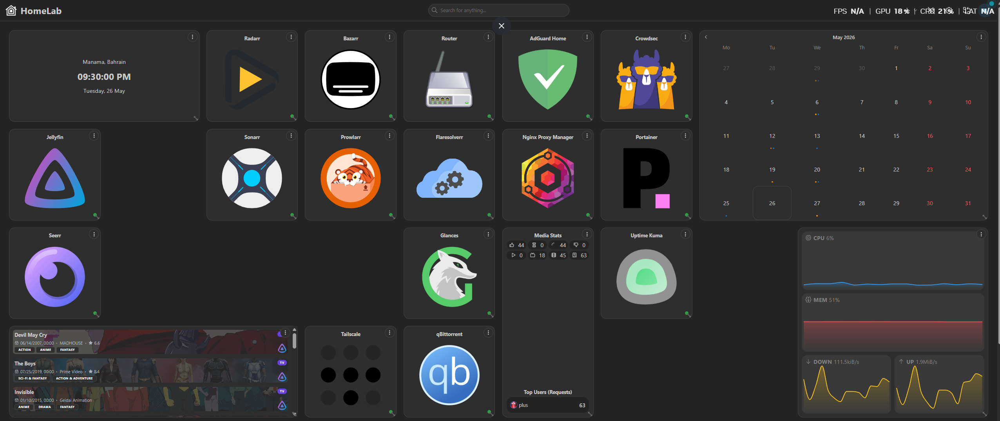
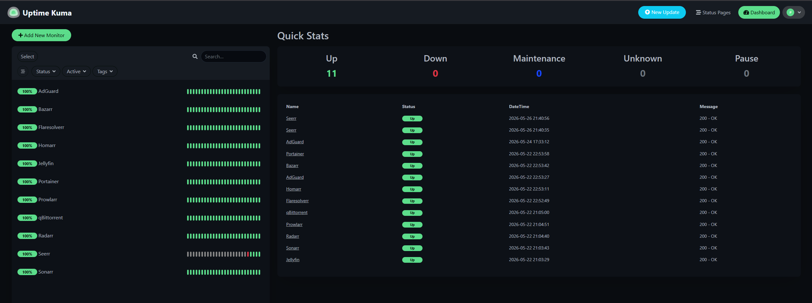
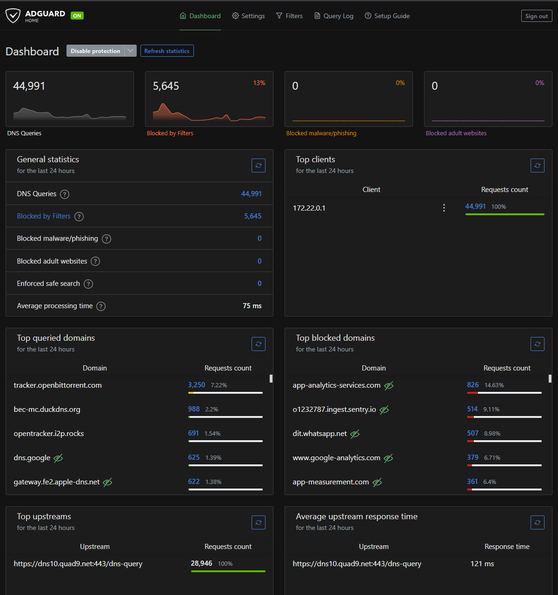
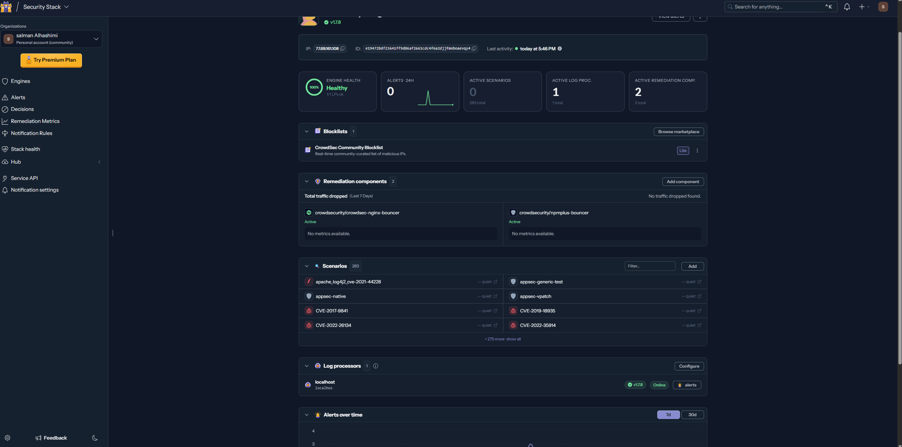
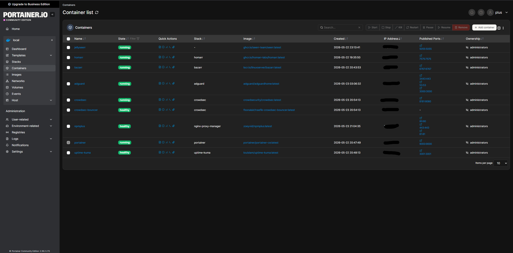
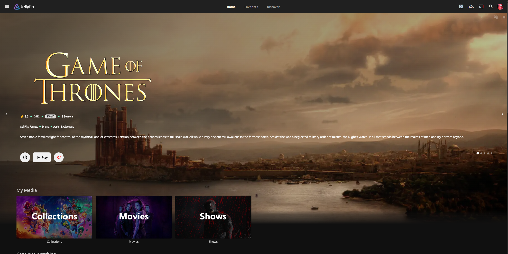

<div align="center">

# 🏠 Personal HomeLab Infrastructure Project


**A fully self-hosted, production-grade home server featuring automated media management, multi-layer security, zero-trust remote access, and comprehensive monitoring — built and maintained entirely from scratch.**

[Features](#-features) · [Architecture](#-architecture) · [Tech Stack](#-tech-stack) · [Security](#-security-stack) · [Services](#-services) · [Skills Demonstrated](#-skills-demonstrated)

</div>

---
## 📸 Screenshots

| Homarr Dashboard | Uptime Kuma |
|---|---|
|  |  |

| AdGuard Home | CrowdSec Console |
|---|---|
|  |  |

| Portainer Containers | Jellyfin Library |
|---|---|
|  |  |


## 📌 Project Summary

This project documents the design, deployment, and ongoing maintenance of a personal homelab server running 15+ self-hosted services. The infrastructure was built with a focus on **security**, **automation**, **high availability**, and **remote accessibility** — mirroring real-world production DevOps practices at a personal scale.

> 🔑 **Key Highlight:** Every component was researched, configured, and troubleshot independently — from bare-metal networking to container orchestration to multi-layer intrusion detection.

---

## ✨ Features

- 🎬 **Self-hosted media ecosystem** — stream, request, and automatically download content
- 🔒 **4-layer security stack** — DNS filtering + WAF + behavioral IDS + real-time alerts
- 🌐 **Zero-trust remote access** — Tailscale VPN with custom DNS, accessible from anywhere
- 📊 **Full observability stack** — real-time system stats, service uptime, and Discord alerts
- 🔀 **Reverse proxy with AppSec** — clean URLs, CrowdSec integration built into NPMplus
- 🤖 **Automated workflows** — subtitle downloads, media management, container monitoring
- 📱 **Mobile-first remote access** — dedicated Homarr board accessible over Tailscale

---

## 🏗️ Architecture

```
┌─────────────────────────────────────────────────────────┐
│                    External Access                      │
│                                                         │
│  Local Network          │      Remote (Tailscale VPN)   │
│    192.168.X.X          │      100.110.X.X              │
└─────────────┬───────────┘──────────────┬────────────────┘
              │                          │
              ▼                          ▼
┌─────────────────────────────────────────────────────────┐
│                   DNS Layer                             │
│           AdGuard Home (192.168.X.X:53)                 │
│         853,000+ blocked domains · DNSSEC · DoH         │
│    .home rewrites (LAN) · .ts rewrites (Tailscale)      │
└─────────────────────────┬───────────────────────────────┘
                          │
                          ▼
┌─────────────────────────────────────────────────────────┐
│              Reverse Proxy + WAF Layer                  │
│              NPMplus (port 80/443/81)                   │
│     CrowdSec AppSec built-in · Clean URL routing        │
│     .home domains (LAN) · .ts domains (Tailscale)       │
└──────┬──────────────────┬──────────────────┬────────────┘
       │                  │                  │
       ▼                  ▼                  ▼
┌─────────────┐  ┌────────────────┐  ┌─────────────────┐
│ Media Stack │  │  Management    │  │  Security/Mon.  │
│             │  │                │  │                 │
│ Jellyfin    │  │ Portainer      │  │ CrowdSec Engine │
│ Sonarr      │  │ Homarr         │  │ Uptime Kuma     │
│ Radarr      │  │ NPMplus Admin  │  │ Glances         │
│ Prowlarr    │  │                │  │ Discord Alerts  │
│ qBittorrent │  └────────────────┘  └─────────────────┘
│ Bazarr      │
│ Seerr v3    │
│ Flaresolverr│
└─────────────┘
```

---

## 🛠️ Tech Stack

### Infrastructure & Orchestration

| Technology | Usage |
|---|---|
| **Docker Desktop** | Container runtime on Windows via WSL2/Hyper-V |
| **Docker Compose** | Per-service isolated compose stacks |
| **Portainer CE** | Container management UI |
| **Windows 10** | Host OS with static IP configuration |
| **PowerShell** | Automation, scheduled tasks, system management |

### Networking & Security

| Technology | Usage |
|---|---|
| **NPMplus** | Reverse proxy with built-in CrowdSec AppSec WAF |
| **AdGuard Home** | DNS-level ad/malware blocking (853k+ rules) |
| **CrowdSec** | Behavioral intrusion detection & IP banning |
| **Tailscale** | Zero-trust WireGuard-based VPN mesh |
| **Namecheap DDNS** | Dynamic DNS for public domain `mcbec.world` |

### Monitoring & Alerting

| Technology | Usage |
|---|---|
| **Uptime Kuma** | HTTP service monitoring with 60s checks |
| **Glances** | Real-time system resource monitoring |
| **Discord Webhooks** | Instant alerts for downtime and IP bans |
| **CrowdSec Console** | Centralized threat visibility dashboard |

### Media & Automation

| Technology | Usage |
|---|---|
| **Jellyfin** | Self-hosted media server with NVENC transcoding |
| **Sonarr / Radarr** | TV and movie download automation |
| **Prowlarr** | Indexer management and aggregation |
| **Bazarr** | Automated subtitle downloads (EN + AR) |
| **Seerr v3** | Media request platform |
| **qBittorrent** | Download client |
| **Flaresolverr** | Cloudflare challenge bypass |

---

## 🔒 Security Stack

A **4-layer defense-in-depth** architecture protecting all services:

```
Layer 1: DNS Filtering (AdGuard Home)
├── 853,000+ blocked domains
├── DNS over HTTPS via Cloudflare (security.cloudflare-dns.com)
├── DNSSEC enabled
└── Phishing / Malware / Tracking blocklists

Layer 2: Reverse Proxy (NPMplus)
├── Block Common Exploits on all hosts
├── Caching and request buffering
└── Hides internal port structure

Layer 3: Application WAF (CrowdSec AppSec — built into NPMplus)
├── Real-time request inspection
├── 53 active attack scenarios
└── CVE detection (Log4j, Apache, etc.)

Layer 4: Behavioral IDS (CrowdSec Engine)
├── Pattern-based IP banning (4h default)
├── Community threat intelligence sharing
├── Discord @everyone alert on every ban
└── CrowdSec Console for centralized visibility
```

---

## 📡 Remote Access Architecture

```
iPhone / Laptop (anywhere in the world)
          │
          ▼
   Tailscale VPN (WireGuard)
          │
          ▼
   Tailscale DNS pushes AdGuard (100.110.X.X) to all devices
          │
          ▼
   .ts domains resolve → Tailscale IP → NPMplus → Services
          │
   e.g. jellyfin.ts → NPMplus → Jellyfin:8096
```

**Key achievement:** No ports opened on router. No SSL certificates required. Works from anywhere with a single Tailscale connection.

---

## 📦 Services

### 🎬 Media Stack

| Service | Version | Purpose |
|---|---|---|
| Jellyfin | Latest | Media server with NVIDIA NVENC hardware transcoding |
| Sonarr | v4 | Automated TV show management and downloading |
| Radarr | Latest | Automated movie management and downloading |
| Prowlarr | Latest | Unified indexer management |
| qBittorrent | Latest | Download client with ratio management |
| Bazarr | Latest | Auto subtitle downloads (English + Arabic) |
| Seerr | v3.2.0 | Media request platform (migrated from Jellyseerr v2) |
| Flaresolverr | Latest | Cloudflare bypass for indexers |

### 🔒 Security & Network

| Service | Purpose |
|---|---|
| AdGuard Home | DNS filtering, DNSSEC, DoH upstream |
| NPMplus | Reverse proxy + CrowdSec AppSec WAF |
| CrowdSec | Behavioral IDS + IP banning + Discord alerts |
| Tailscale | Zero-trust VPN mesh network |

### 📊 Monitoring & Management

| Service | Purpose |
|---|---|
| Uptime Kuma | Service uptime monitoring with Discord alerts |
| Glances | Real-time system stats (CPU, RAM, network, disk) |
| Portainer CE | Docker container management UI |
| Homarr | Unified dashboard with live widgets |

---

## 🖥️ Hardware

| Component | Specification |
|---|---|
| **CPU** | AMD Ryzen 5 5600 (6c/12t @ 3.5GHz) |
| **RAM** | 32GB DDR4 |
| **GPU** | NVIDIA GTX 1660 SUPER (NVENC transcoding) |
| **Motherboard** | ASUS PRIME B450M-K II |
| **Storage** | 500GB SSD (OS) + 6TB HDD (Media) + 1TB HDD (Games) + 4TB HDD |
| **OS** | Windows 10 64-bit |
| **Network** | Gigabit Ethernet, Static IP |

---

## 🌐 Networking Details

| Feature | Implementation |
|---|---|
| **Local DNS** | AdGuard Home with `.home` domain rewrites |
| **Remote DNS** | AdGuard pushed via Tailscale to all devices |
| **Local URLs** | `http://service.home` via NPMplus on LAN |
| **Remote URLs** | `http://service.ts` via NPMplus over Tailscale |
| **DDNS** | Namecheap Dynamic DNS Client (`mcbec.world`) |
| **Docker Gateway** | `192.168.65.254` for container→host communication |

---

## 💡 Skills Demonstrated

### DevOps & Infrastructure
- ✅ Containerization with Docker and Docker Compose
- ✅ Multi-service orchestration with isolated stacks
- ✅ Reverse proxy configuration and routing
- ✅ Service health monitoring and alerting
- ✅ Automated container update workflows

### Networking
- ✅ Static IP configuration and subnet management
- ✅ DNS server setup and custom record management
- ✅ Reverse proxy with virtual host routing
- ✅ VPN mesh networking (Tailscale/WireGuard)
- ✅ Dynamic DNS and domain management
- ✅ Port forwarding and NAT configuration

### Security
- ✅ Defense-in-depth security architecture
- ✅ DNS-level threat blocking (853k+ rules)
- ✅ Intrusion detection and automated IP banning
- ✅ Web Application Firewall configuration
- ✅ Zero-trust network access implementation
- ✅ Security monitoring and Discord alerting

### Systems Administration
- ✅ Windows Server administration via PowerShell
- ✅ Scheduled task automation
- ✅ System performance monitoring
- ✅ Storage management across multiple drives
- ✅ Service troubleshooting and log analysis

### Software & Automation
- ✅ Media server setup with hardware transcoding
- ✅ Automated download pipeline configuration
- ✅ Multi-language subtitle automation
- ✅ Webhook integration for real-time notifications
- ✅ REST API integration across multiple services

---

## 📈 Project Outcomes

- 🟢 **15+ services** running concurrently with minimal resource usage
- 🛡️ **853,000+ threats** blocked at DNS level
- 🚨 **Real-time alerts** for any downtime or security event
- 📱 **Full remote access** from any device via Tailscale with no exposed ports
- 🔄 **Zero-downtime** service updates via Portainer
- 🌍 **Accessible from anywhere** with clean URLs and proper DNS routing

---

## 🗂️ Project Structure

```
C:\docker\
├── adguard\          # AdGuard Home DNS server
├── bazarr\           # Subtitle automation
├── crowdsec\         # IDS + Discord notifications
│   └── config\
│       ├── profiles.yaml
│       └── notifications\
│           └── discord.yaml
├── homarr\           # Dashboard
├── nginx-proxy-manager\ # NPMplus reverse proxy
│   └── data\
├── portainer\        # Container management
├── uptime-kuma\      # Monitoring
└── uptime-kuma\      # Uptime monitoring

C:\Docker\
└── jellyseerr\       # Media request platform
```

---

## 🔮 Planned Improvements

- [ ] **Authelia** — 2FA authentication layer for externally exposed services
- [ ] **Home Assistant** — Smart home automation integration
- [ ] **Proxmox** — Migrate to bare-metal hypervisor for better isolation
- [ ] **Offsite backup** — Automated cloud backup for critical configs

---

## 📚 Key Learning Resources

Throughout this project, the following technologies were researched and implemented:

`Docker` `Docker Compose` `Nginx` `DNS` `AdGuard` `CrowdSec` `Tailscale` `WireGuard` `PowerShell` `YAML` `Reverse Proxy` `WAF` `IDS/IPS` `DDNS` `Webhooks` `REST APIs` `Linux` `Windows Server` `Networking` `Security`

---

<div align="center">

**Built by Salman Alhashimi**

[](https://www.linkedin.com/in/sayed-salman-alhashimi/)


*This project represents 100+ hours of research, implementation, troubleshooting and documentation.*

</div>
